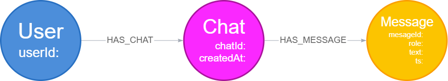
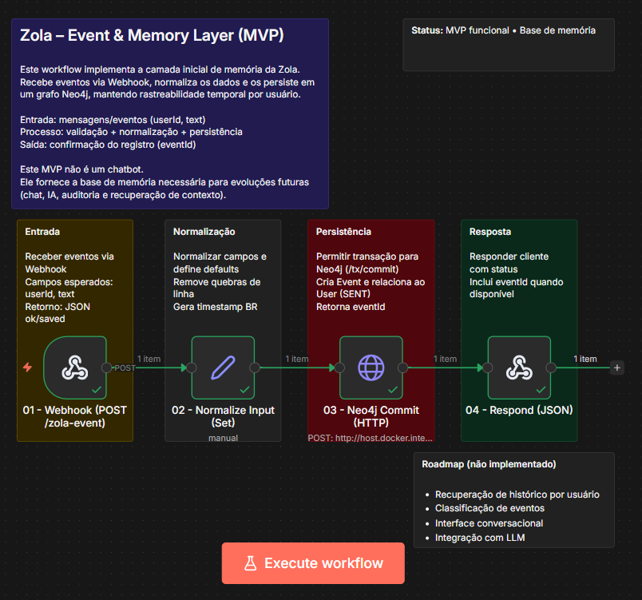
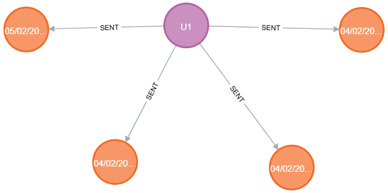

# Zola – Event & Memory Layer (MVP)

Camada inicial de **memória baseada em eventos**, construída com **n8n + Neo4j**.  
Este projeto registra eventos de usuários em um grafo, criando a base para análises, contexto e futuras integrações com IA.

> Este MVP **não é um chatbot**.  
> Ele resolve **memória e persistência**, não conversação.
---

## 🎯 Objetivo

Criar uma arquitetura simples e extensível capaz de:

- Receber eventos via Webhook
- Normalizar dados de entrada
- Persistir eventos em um banco de dados em grafo (Neo4j)
- Manter histórico temporal por usuário
- Retornar confirmação do registro ao cliente

---

## Modelagem Conceitual



---

## Fluxo do Workflow (n8n)



O workflow é totalmente documentado internamente com *sticky notes*, facilitando manutenção futura.

---

## Modelo de Dados (Neo4j)



Cada evento mantém:
- timestamp nativo (`datetime()`)
- timestamp formatado para leitura humana (BR)

---

## 📥 Exemplo de Requisição

```json
POST /zola-event
{
  "userId": "user_001",
  "text": "Evento de teste"
}
{
  "ok": true,
  "saved": true,
  "eventId": "UUID-gerado"
}
```
---
## Tecnologias Utilizadas

- n8n (workflow automation)
- Neo4j (graph database)
- Cypher (linguagem de consulta)
- Docker (ambiente local)
- HTTP Webhooks

---
## Segurança e Boas Práticas

- Nenhuma credencial sensível versionada
- Autenticação do Neo4j configurada via Credentials do n8n
- Workflow exportado em versão sanitizada
- Estrutura preparada para ambientes locais e futuros deploys

---
## Status

**MVP funcional**

Base de memória pronta para evoluções futuras (chat, IA, auditoria e contexto)

---
## Autoria

Projeto desenvolvido por Mirele Alves

GitHub: https://github.com/MireleAlves

LinkedIn: https://www.linkedin.com/in/mirele-alves/
